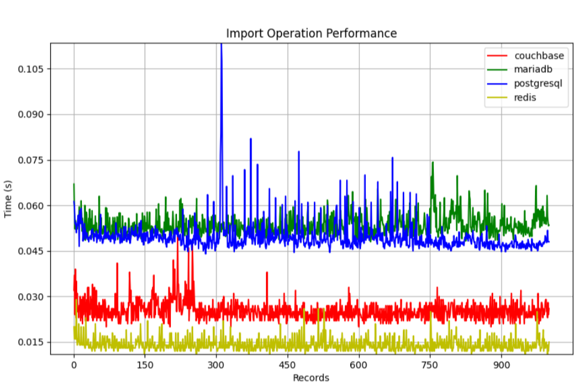
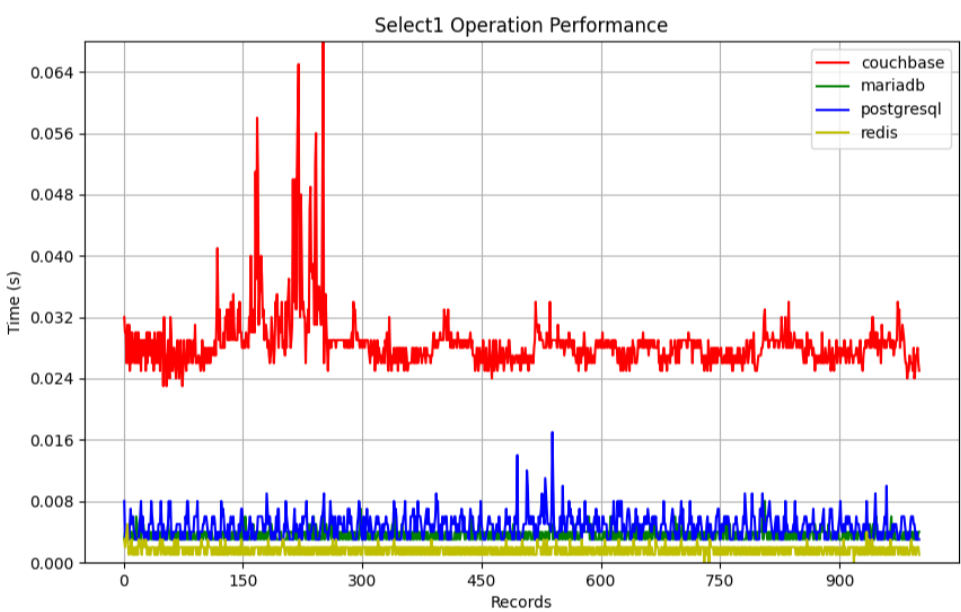
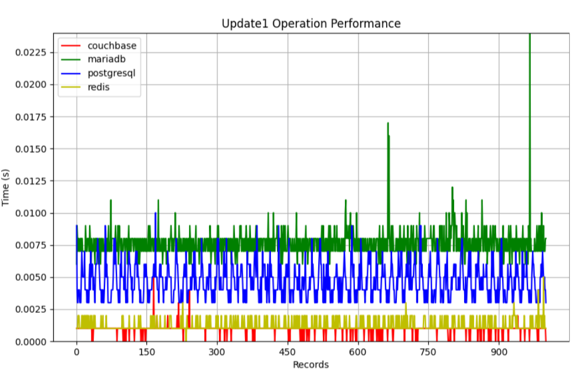
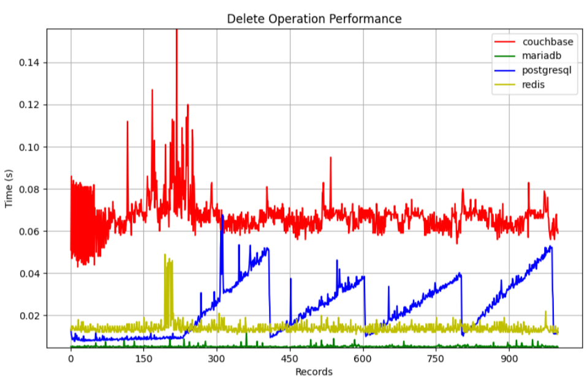

# **Database Performance**

## **Project Overview**
This project evaluates the **performance of different database systems** by benchmarking key operations such as **insertion, selection, update, and deletion**. The goal is to compare **query execution time, data processing efficiency, and scalability** across **Couchbase, Redis, PostgreSQL, and MariaDB** under various workloads.

The databases were containerized using **Docker**, and performance tests were executed in **Java**. The results were visualized through analytical charts to assess how each system handles different operations.

## **Benchmarking Metrics**
- **Insert Performance** – Measures the speed of inserting data into each database.
- **Select Performance** – Evaluates query execution time for data retrieval.
- **Update Performance** – Analyzes the efficiency of modifying existing records.
- **Delete Performance** – Tests the speed of data removal.

## **Technologies Used**
- **Java** – Performance testing and benchmarking
- **Docker** – Containerized database deployment
- **Couchbase** – NoSQL document-oriented database
- **Redis** – In-memory key-value store
- **PostgreSQL** – Relational database with SQL support
- **MariaDB** – MySQL-compatible relational database

## **Results & Analysis**
The benchmarking results are visualized through various performance plots:
- **Insert Performance:** Measures the time taken to insert 100+ records.
- **Select Performance:** Compares query execution times.
- **Update & Delete Performance:** Evaluates data modification speeds.

Below are sample performance charts generated during the benchmarking process:

### **Insert Operation Performance**


### **Select Operation Performance**


### **Update Operation Performance**


### **Delete Operation Performance**


## **Conclusion**
This project provides a **comprehensive performance comparison** between NoSQL and SQL databases under different workloads. The insights from this benchmarking help in selecting the most suitable database system for specific use cases.

## **Setup & Installation**
### **1. Clone the Repository**
```bash
git clone https://github.com/IvanFilipchuk/PRCM.git
cd PRCM
```

### **2. Start Docker Containers**
Make sure you have **Docker** installed and running. Then, start the database containers:
```bash
docker-compose up -d
```
